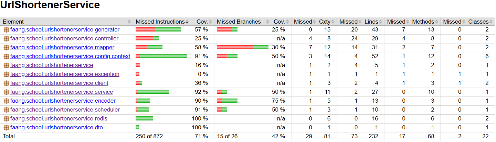

# 🌐 URL Shortener Service

## 📝 Overview

The **URL Shortener Service** is a backend microservice designed to convert long URLs—such as referral or tracking links—into short, user-friendly URLs. This is particularly beneficial for sharing links on social media platforms, where shorter URLs improve readability and aesthetics.

This service is part of a **microservice-based URL shortening app**. The app can be deployed locally using **Docker Compose** or on a **Kubernetes cluster**, and consists of the following components:

- 🔗 [**URL Shortener Service**](https://github.com/dobrevd/url_shortener_service) — The core backend service for creating and resolving shortened URLs.
- 📈 [**URL Audit Service**](https://github.com/dobrevd/url-audit-service) — Responsible for logging and analyzing user interactions for auditing purposes.
- 🖥️ [**Frontend Application**](https://github.com/dobrevd/url-shortener-frontend) — A user-friendly web interface for interacting with the system.
- 📊 [**URL Stats Service**](https://github.com/dobrevd/url_stats_service) — A microservice (currently under development) for providing real-time and historical statistics on URL usage. It will be deployed on **AWS ECS with Fargate**.
- 🏗️ [**URL Stats Service – Infrastructure as Code with AWS CDK (Java)**](https://github.com/dobrevd/url_shortener_stats_cdk) — Infrastructure-as-Code solution for deploying the **URL Stats Service** using the **AWS Cloud Development Kit (CDK)** in **Java**. This repository enables scalable, maintainable, and repeatable AWS deployments, automating cloud infrastructure provisioning and management.

## Features

The primary function of the service is to **shorten URLs**, but it also includes several advanced features such as:

- **Database Integration**: The application integrates with a PostgreSQL database. It uses a **custom database sequence** (`unique_number_seq`) to generate unique numeric identifiers, which are then encoded into Base62 strings to serve as URL hashes.
The `url` table stores entities representing the mapping between **short hashes** and their corresponding **original (long) URLs**, along with metadata such as creation timestamps. Each hash is unique and enforced via a unique constraint in the database.

- **Local Caching**: Local caching is implemented using a thread-safe `ConcurrentLinkedQueue` to store pre-generated hashes, allowing efficient and safe retrieval under high concurrency without accessing PostgreSQL each time.
Upon application startup, the queue is initialized with hashes retrieved from PostgreSQL. These hashes are generated using a database sequence (`nextval`) and encoded via a `Base62Encoder`.
If the number of available hashes in the queue drops below a configured threshold (`minValue`), the cache is automatically refilled *asynchronously* in the background. This design ensures low-latency access to unique hashes while minimizing database load.

- **General Caching**: Redis is used to implement the Cache-Aside Strategy. Frequently accessed data is first looked up in Redis; if not found (cache miss), it is retrieved from the database, returned to the caller, and then cached in Redis for future access. This improves performance and reduces load on the database.

- **Resource Scheduler**:  In addition to on-demand generation, hashes are also generated **periodically** based on a configurable cron schedule. This background task proactively fills the database with fresh hashes, ensuring availability for both immediate and future needs.

## 🔄 Microservice Interaction

The URL Shortener platform enables seamless microservice communication through two main mechanisms:

- 📡 **REST API** — Used by the **Frontend Application** to interact with the **URL Shortener Service**.
- 📨 **Kafka Events** — The **URL Shortener Service** publishes events to **Kafka**, which are consumed by the **URL Audit Service** for tracking and analytics.

This architecture ensures loose coupling, scalability, and real-time data processing across services.

## ⚙️ Kafka Producer Configuration
- **`BOOTSTRAP_SERVERS_CONFIG`** — List of Kafka broker addresses to connect to.

- **`KEY_SERIALIZER_CLASS_CONFIG`** — Serializer for the message key (e.g., `StringSerializer`).

- **`VALUE_SERIALIZER_CLASS_CONFIG`** — Serializer for the message value (e.g., `JsonSerializer`).

- **`ACKS_CONFIG`** — Defines the number of acknowledgments the producer requires (`all` ensures strongest durability).

- **`DELIVERY_TIMEOUT_MS_CONFIG`** — Max time Kafka will attempt to deliver a message before failing.

- **`LINGER_MS_CONFIG`** — Delay in milliseconds to allow batching of more messages for improved throughput.

- **`REQUEST_TIMEOUT_MS_CONFIG`** — Time to wait for broker response before considering the request as failed.

- **`ENABLE_IDEMPOTENCE_CONFIG`** — Ensures no duplicate messages are sent on retries (for exactly-once delivery).

- **`MAX_IN_FLIGHT_REQUESTS_PER_CONNECTION`** — Max number of unacknowledged requests per connection (≤5 when idempotence is enabled).

## GitHub Actions Workflow

### 📌 Overview
This GitHub Actions workflow automates the **build and deployment** process for the Url Shortener Service application.

### 🚀 Trigger Conditions
- Runs on **push** and **pull request** events to the `master` branch.

### 🛠️ Build Job (`build`)
✅ **Steps:**
- 🏗️ **Checkout Repository** – Clones the project repository.
- 🔧 **Set Permissions** – Grants execute permissions to the Gradle wrapper.
- ☕ **Set up JDK 17** – Installs Temurin JDK 17.
- ⚙️ **Configure Gradle** – Sets up Gradle for dependency management.
- 🏗️ **Build Project** – Runs `./gradlew build -x test` to compile the application.
- 🧪 **Run Tests with JaCoCo** – Executes tests and generates a code coverage report using JaCoCo (via ./gradlew test jacocoTestReport).
- 📦 **Save JaCoCo Report** – Uploads the generated JaCoCo report as an artifact to track test coverage.
- 📦 **Save Artifact** – Stores the generated JAR file for later use.

### 🐳 Docker Job (`docker`)
✅ **Steps:**
- 📥 **Download JAR Artifact** – Retrieves the built application from the previous job.
- 🧐 **Verify JAR File** – Ensures the artifact is available.
- 🔐 **Log in to Docker Hub** – Uses GitHub Secrets for authentication.
- 🏗️ **Build Docker Image** – Creates a Docker image for the application.
- 📤 **Push to Docker Hub** – Publishes the Docker image for deployment.

### 🔄 CI/CD Process
This workflow ensures **continuous integration and deployment**, making the application **automatically available as a Docker image** on every update to the `master` branch.

## The **Url Shortener Service** can be run locally using **Kubernetes**.

## 🧪 Code Coverage with JaCoCo

**Url Shortener Service** uses **JaCoCo** to generate code coverage reports and enforce a minimum coverage threshold during testing.

- A **minimum line coverage threshold of 68%** is enforced.
- The **build will fail** if the actual coverage is below this threshold.
- Test coverage reports are generated in multiple formats: **HTML** and **XML**.

### 📁 View the Report

